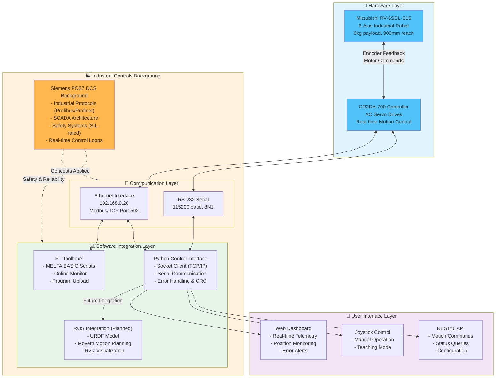

# Robot Arm System Architecture

## Architecture Overview

### Hardware Layer
- **Robot**: Mitsubishi RV-6SDL-S15 6-axis industrial robot with harmonic drives and AC servo motors
- **Controller**: CR2DA-700 industrial controller managing real-time motion control and safety systems

### Communication Layer
- **Ethernet (Modbus/TCP)**: Primary interface for high-level commands and telemetry (192.168.0.20:502)
- **RS-232 Serial**: Alternative/diagnostic interface for low-level communication (115200 baud)

### Software Integration Layer
- **RT Toolbox2**: Official Mitsubishi software for MELFA BASIC programming and diagnostics
- **Python Control Interface**: Custom-built communication layer with robust error handling
- **ROS Integration (Planned)**: Motion planning and visualization using ROS ecosystem

### User Interface Layer
- **Web Dashboard**: Real-time monitoring and control interface
- **Joystick Control**: Manual operation and teaching capabilities
- **RESTful API**: Programmatic access for automation workflows

### Industrial Controls Background
**DCS Engineering Experience Applied:**
- Deterministic communication protocols from Siemens PCS7 work
- Safety system design principles (SIL-rated controls)
- SCADA architecture patterns for telemetry and monitoring
- Real-time control loop concepts from process automation

---

**Technical Notes:**
- All communication includes CRC checksums and timeout/retry mechanisms
- State machine manages connection lifecycle and error recovery
- Modular design allows swapping communication methods without affecting high-level control
- Future ROS integration will add advanced motion planning and collision detection
